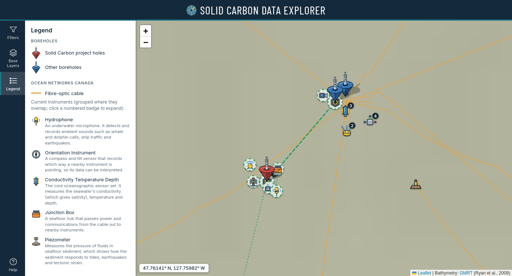
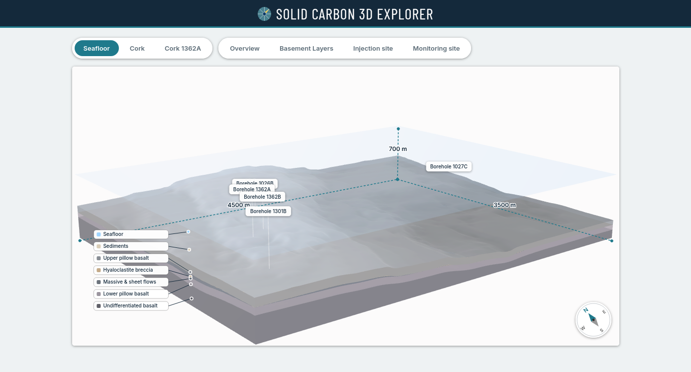

# SC-map

Interactive map of the Solid Carbon project: boreholes, Ocean Networks Canada (ONC) instruments and cables in the Cascadia Basin and Clayoquot Slope, plus the monitoring planned by the project. A separate 3D viewer shows the seafloor and CORK models.

Built with [Leaflet](https://leafletjs.com) and plain JavaScript. There is no build step.

## View it online

### Map

https://tjauvic.github.io/SC-map/



### 3D viewer

https://tjauvic.github.io/SC-map/3d/



## Run it locally

The page loads data files, so open it through a local web server rather than double-clicking `index.html`:

```
python3 -m http.server 8000
```

Then visit http://localhost:8000 (map) or http://localhost:8000/3d/ (3D viewer).

## Layout

| Path | What it holds |
|---|---|
| `index.html` | The map page and sidebar (Filters, Base Layers, Legend, Help) |
| `css/map.css` | All map styles |
| `js/boreholes.js` | Borehole records: location, depths, and which datasets exist |
| `js/datalinks.js` | Links to each borehole's datasets |
| `js/config.js` | Dataset filter list and map settings |
| `js/cables.js` | ONC cable lines |
| `js/map.js` | Map, basemaps, borehole markers and popups |
| `js/instruments.js` | Current and planned ONC instrument layers |
| `js/instrument-catalog.js` | Instrument types: icon and description for each |
| `js/borehole-icons.js` | Borehole marker images |
| `js/controls.js` | Sidebar panels, legend, cursor coordinates |
| `js/labels.js` | Named seamount labels that appear when zoomed in |
| `assets/*.geojson` | Instrument and planned-monitoring locations |
| `assets/icons/` | Editable SVG icons for instruments and boreholes |
| `3d/` | 3D viewer and its `.glb` models |

## Data sources

Data compiled by [Ocean Networks Canada](https://www.oceannetworks.ca) for the [Solid Carbon](https://solidcarbon.ca) project. Seafloor bathymetry from [GMRT](https://www.gmrt.org). Cable data from ONC's ArcGIS layer. Other basemaps from Esri and OpenStreetMap.
